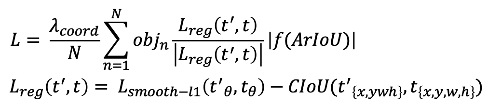
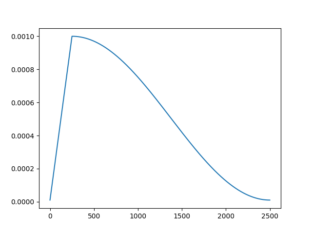
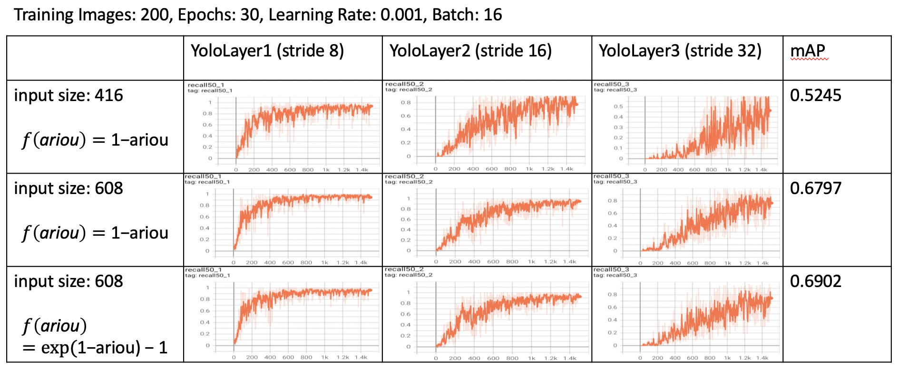
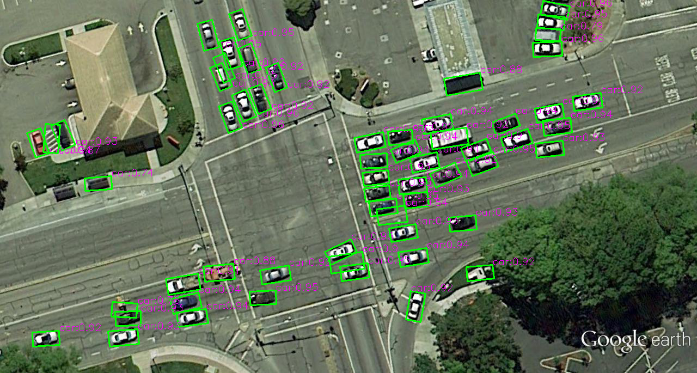
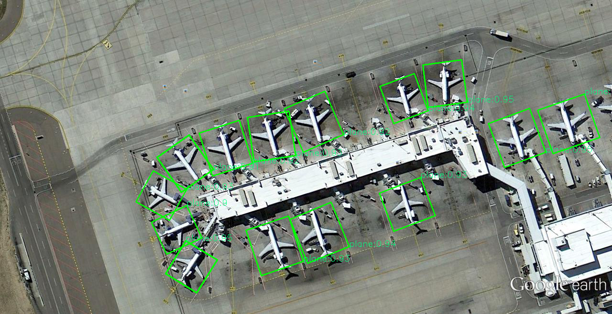
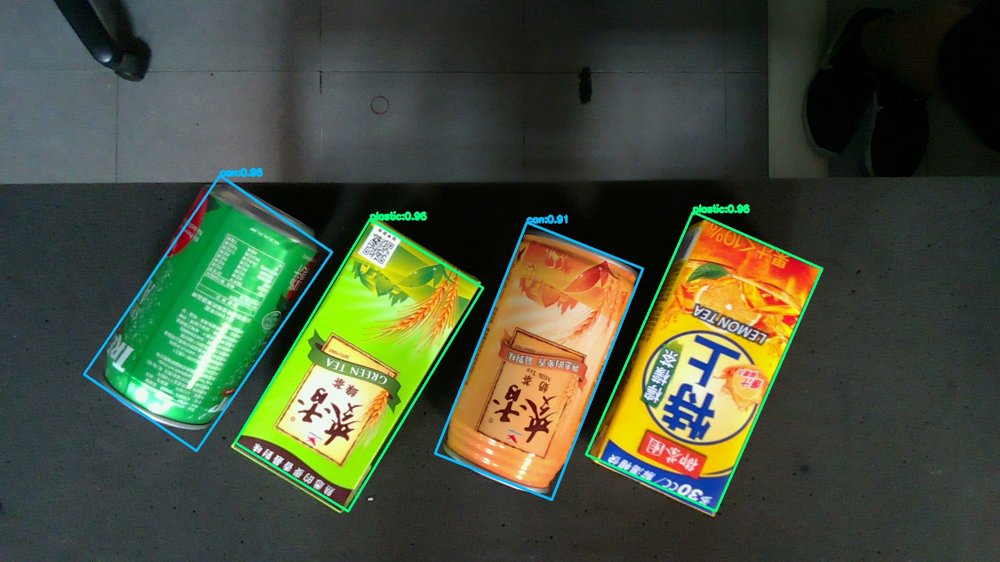
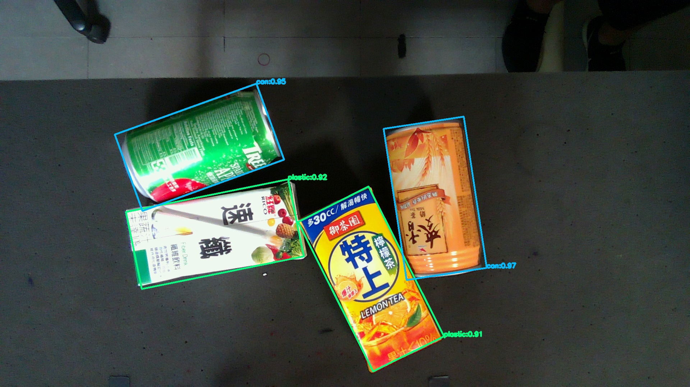

# R-YOLOv4

This is a PyTorch-based R-YOLOv4 implementation which combines YOLOv4 model and loss function from R3Det for arbitrary oriented object detection.
(Final project for NCKU INTRODUCTION TO ARTIFICIAL INTELLIGENCE course)

### Dataset

**UCAS-High Resolution Aerial Object Detection Dataset (UCAS-AOD)**

Label: x1, y1, x2, y2, x3, y3, x4, y4, theta, x, y, width, height </br>
(x1, y1) is the coordinate located on the upper left of the bounding box, and then (x2, y2), (x3, y3) and (x4, y4) following the clockwise order respectively.

Though it provides theta for each bounding box, it is not within the angle range that I want. You can check out how I calculated the angle that I need in tools/load.py.

### Features

---
#### Loss Function (only for x, y, w, h, theta)




I implemented the loss function proposed by [R3Det: Refined Single-Stage Detector with Feature Refinement for Rotating Object](https://arxiv.org/abs/1908.05612) and made some adjustments for myself.

---
#### Scheduler
Cosine Annealing with Warmup (Reference: [Cosine Annealing with Warmup for PyTorch](https://github.com/katsura-jp/pytorch-cosine-annealing-with-warmup))
</br>


---
#### Recall



As the paper suggested, I get a better results from **f(ariou) = exp(1-ariou)-1**. Therefore I used it for my loss function.


### Usage

1. Clone and install requirements
```
$ git clone https://github.com/kkkunnnnethan/R-YOLOv4.git
$ cd R-YOLOv4/
$ pip install -r requirements.txt
```

2. Download dataset and weights

* Dataset c
I have  provided some datasets example on my github. Still, you have to download the others by yourself and arrange it in the correct directories like I do.
* Weights </br>
[yolov4 pretrained weights](https://drive.google.com/uc?export=download&id=1sVD2d_y9VDirA-XOdcVDKCDrQw3e7ZJY) </br>
[UCAS-AOD weights](https://drive.google.com/uc?export=download&id=1UDp_DB2gbPSzBIpgAJuLIFqu8hgl57Ip) (weights that I have already trained for this dataset)

3. Make sure your files arrangment looks like the following
```
R-YOLOv4/
├── train.py
├── test.py
├── detect.py
├── requirements.txt
├── model
    ├── init.py
    ├── backbone.py
    ├── neck.py
    ├── head.py
    ├── yololayer.py
    ├── model.py
    ├── loss.py
    └── utils.py
├── tools
    ├── augments.py
    ├── load.py
    ├── logger.py
    ├── plot.py
    ├── post_process.py
    ├── scheduler.py
    └── utils.py
├── weights
    ├── yolov4.pth (for training)
    └── AOD_800.pth (for testing and detection)
├── data
    ├── coco.names
    ├── train
        ├── 0
            ├── ...png
            └── ...txt
        └── 1
            ├── ...png
            └── ...txt
    ├── test
        ├── 0
            ├── ...png
            └── ...txt
        └── 1
            ├── ...png
            └── ...txt
    └── detect
        └── ...png
├── outputs
└── logs
```

### Train

```
usage: train.py [-h] [--train_folder TRAIN_FOLDER] [--weights_path WEIGHTS_PATH] [--class_path CLASS_PATH]
                [--epochs EPOCHS] [--lr LR] [--batch_size BATCH_SIZE] [--subdivisions SUBDIVISIONS]
                [--img_size IMG_SIZE]
```

##### Training Log
```
+--------------+--------------------+--------------------+--------------------+--------------------+
| Step: 1/2000 | loss               | reg_loss           | conf_loss          | cls_loss           |
+--------------+--------------------+--------------------+--------------------+--------------------+
| YoloLayer1   | 3.254406690597534  | 0.7356357574462891 | 1.8155715465545654 | 0.7031993269920349 |
| YoloLayer2   | 3.9455742835998535 | 1.1916611194610596 | 2.0590732097625732 | 0.6948400139808655 |
| YoloLayer3   | 4.292110919952393  | 1.5909397602081299 | 1.99018132686615   | 0.7109898924827576 |
+--------------+--------------------+--------------------+--------------------+--------------------+
```

##### Tensorboard
If you would like to use tensorboard for tracking traing process.

* Open additional terminal in the same folder where you are running program.
* Run command ```$ tensorboard --logdir='logs' --port=6006``` 
* Go to [http://localhost:6006/]( http://localhost:6006/)


### Test

| Method | Plane | Car | mAP |
| -------- | -------- | -------- | -------- |
| YOLOv4 (smoothL1-iou) | 97.68 | 90.76 | 94.22|

```
usage: test.py [-h] [--test_folder TEST_FOLDER] [--weights_path WEIGHTS_PATH] [--class_path CLASS_PATH]
               [--conf_thres CONF_THRES] [--nms_thres NMS_THRES] [--iou_thres IOU_THRES] [--batch_size BATCH_SIZE]
               [--img_size IMG_SIZE]
```

### Detect

```
usage: detect.py [-h] [--image_folder IMAGE_FOLDER] [--output_folder OUTPUT_FOLDER] [--weights_path WEIGHTS_PATH]
                 [--class_path CLASS_PATH] [--conf_thres CONF_THRES] [--nms_thres NMS_THRES]
                 [--batch_size BATCH_SIZE] [--img_size IMG_SIZE]

```




**Results on other datasets**
</br>




### References
[yangxue0827/RotationDetection](https://github.com/yangxue0827/RotationDetection) </br>
[eriklindernoren/PyTorch-YOLOv3](https://github.com/eriklindernoren/PyTorch-YOLOv3) </br>
[Tianxiaomo/pytorch-YOLOv4](https://github.com/Tianxiaomo/pytorch-YOLOv4)


### Credit

**YOLOv4: Optimal Speed and Accuracy of Object Detection**

*Alexey Bochkovskiy, Chien-Yao Wang, Hong-Yuan Mark Liao*

**Abstract**
There are a huge number of features which are said to improve Convolutional Neural Network (CNN) accuracy. Practical testing of combinations of such features on large datasets, and theoretical justification of the result, is required. Some features operate on certain models exclusively and for certain problems exclusively, or only for small-scale datasets; while some features, such as batch-normalization and residual-connections, are applicable to the majority of models, tasks, and datasets...

```
@article{yolov4,
  title={YOLOv4: Optimal Speed and Accuracy of Object Detection},
  author={Alexey Bochkovskiy, Chien-Yao Wang, Hong-Yuan Mark Liao},
  journal = {arXiv},
  year={2020}
}
```

**R3Det: Refined Single-Stage Detector with Feature Refinement for Rotating Object**

*Xue Yang, Junchi Yan, Ziming Feng, Tao He*

**Abstract**
Rotation detection is a challenging task due to the difficulties of locating the multi-angle objects and separating them effectively from the background. Though considerable progress has been made, for practical settings, there still exist challenges for rotating objects with large aspect ratio, dense distribution and category extremely imbalance. In this paper, we propose an end-to-end refined single-stage rotation detector for fast and accurate object detection by using a progressive regression approach from coarse to fine granularity...

```
@article{r3det,
  title={R3Det: Refined Single-Stage Detector with Feature Refinement for Rotating Object},
  author={Xue Yang, Junchi Yan, Ziming Feng, Tao He},
  journal = {arXiv},
  year={2019}
}
```
